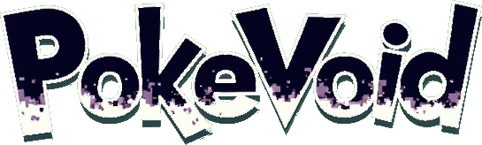

<picture></picture>

A fusion of Pokémon catching and battling with challenging roguelike gameplay. Every run is a fresh gauntlet of Pokémon battles! You'll progress through floors packed with unpredictable clashes. facing random pokemon, rivals, legendary bosses, evil teams, all while building your team on the fly.

PokéVoid lovingly builds upon PokeRogue's excellent gameplay and adds 12 months worth of dedicated work, to make an experience unlike any other!

#### Running Locally
1. Clone the repo and in the root directory run `npm install`
    - *if you run into any errors, reach out in the **#dev-corner** channel in discord*
2. Run `npm run start:dev` to locally run the project in `localhost:8000`

### 💻 Environment Setup
#### Prerequisites
- node: 18.3.0
- npm: [how to install](https://docs.npmjs.com/downloading-and-installing-node-js-and-npm)

### ❔ FAQ 

**How do I test a new _______?**
- In the `src/overrides.ts` file there are overrides for most values you'll need to change for testing

# 📝 Credits

**PokéVoid wouldn't exist without the brilliant foundation of PokeRogue.** I've spent countless sleepless nights (at a age I'm not supposed to do that at anymore) completely hooked on PokeRogue, losing track of time as I dove deeper into its perfectly balanced mechanics and captivating gameplay. Days blurred together as I found myself unable to put it down, constantly thinking 'just one more run' until the sun rose again.

Even after I 100%-ed everything the game had to offer, I still couldn't tear myself away - that's when the idea for PokéVoid emerged. Where PokeRogue stands as a shining beacon of what a Pokémon roguelike should be, PokéVoid attempts to venture into the shadows, bringing a touch of beautiful chaos and corruption to that near-perfect formula.

My heartfelt thanks to the exceptional team behind PokeRogue - their thoughtful design, attention to detail, and commitment to creating an extendable framework made it possible for passionate fans like me to build upon their remarkable work. The fact that they created such a solid foundation allowed me to experiment and 'break things' in ways that somehow still work, which speaks volumes about the quality of their codebase.This project would never have been possible without their innovative vision. As such If you enjoy features like daily runs, mystery encounters, fun themed events, challenge modes, splice mode, endless mode, and much much more - please visit the OG pokerouge.net - they truly deserve recognition for making the game that inspired it all.

> If this project contains assets you have produced and you do not see your name here, **please** reach out.

🌀 Pokevoid Credits - Discord Shoutout 🥳
Special thanks to Scoom & Lily Alterni who helped teach me the ways of discord, and continuously help in finding Bugs and keeping the discord flowing - thank you so much!!  
Also to ALL the pokevoid discorders that are super awesome, friendly, helpful, all coming together in a collective effort to overcome the void!

Pokerogue Credits
🎵 Music
BGM
Pokémon Mystery Dungeon: Explorers of Sky
Arata Iiyoshi
Hideki Sakamoto
Keisuke Ito
Ken-ichi Saito
Yoshihiro Maeda
Pokémon Black/White
Go Ichinose
Hitomi Sato
Shota Kageyama
Pokémon Mystery Dungeon: Rescue Team DX
Keisuke Ito
Arata Iiyoshi
Atsuhiro Ishizuna
Pokémon HeartGold/SoulSilver
Pokémon Black/White 2
Pokémon X/Y
Pokémon Omega Ruby/Alpha Sapphire
Pokémon Sun/Moon
Pokémon Ultra Sun/Ultra Moon
Pokémon Sword/Shield
Pokémon Legends: Arceus
Pokémon Scarlet/Violet
Firel (Custom Graveyard, Ice Cave, Laboratory, Metropolis, Plains, Power Plant, Seabed, Space, and Volcano biome music)
Lmz (Custom Ancient Ruins, Jungle, and Lake biome music)
Andr06 (Custom Forest, Slum and Sea biome music)
_tresnoir
unveiler
Sound Effects
Pokémon Emerald
Pokémon Black/White
🎨 Art
Backgrounds
Squip (Paid Commissions)
Contributions by Someonealive-QN
UI
GAMEFREAK
LJ Birdman
Pagefault Games Intro
Spectremint
Game Logo
Gonstar (Paid Commission)
Trainer Sprites
GAMEFREAK (Pokémon Black/White 2, Pokémon Diamond/Pearl)
kyledove
Brumirage
pkmn_realidea (Paid Commissions)
IceJkai
Leparagon
wormhood
Mystery Event Sprites
chrysomelinae
koda_want_to_sleep
"🐺Kieran/YJ 🐍" rival_kieran aka thedreadedden
ImperialSympathizer
wormhood
gerolau
otterwatch
Trainer Portraits
pkmn_realidea (Paid Commissions)
Pokémon Sprites and Animation
In addition to the lists below, please check the PokéRogue wiki for a more detailed list of Pokémon Sprite credits.

GAMEFREAK (Pokémon Black/White 2)
Smogon Sprite Project (Various Artists)
Skyflyer
Nolo33
Ebaru
EricLostie
kiriaura
Caruban
Sopita_Yorita
Azrita
AshnixsLaw
Hellfire0raptor
RetroNC
Franark122k
OldSoulja
PKMarioG
ItsYugen
lucasomi
Pkm Sinfonia
Poki Papillon
Fleimer_
bizcoeindoloro
mangalos810
selstar
Static Sprites and Base Shiny Replacements Credits
AMVictory
Antiant
Arhops
arinoelle
Arkeis
aXl
BananaToast
Basic Vanillite
BlackWhiteRobin
Blaquaza
Branflakes325
Brylark
Buna
Bynine
Corson
Cynda
"Diashi" diazhi
Dleep
doomchaos
Espeon Scientist
Farriella
fishbowlsoul90
"Follower" rulerofthesea11
Galifia
GeoisEvil
G.E.Z.
Glustora
Harrie
HealnDeal
Hematite
HM100
Ice-cold Claws
Involuntary Twitch
"Jay" itsamejay
KattenK
KingOfThe-X-Roads
KyleDove
Kyleo
Kyuzeth
Larryturbo
Layell
Legitimate Username
leParagon
"LJ" lj_birdman
Luigi Player
Madmadness65
Mega-Pokebattlerz
Mintly
mjco
"Momo" sphinx_sage
MrDollSteak
MyMarshlands
N-Kin
Noscium
"Nova" fabunova
"Omniv" omniv
paintseagull
princessofmusic
PumpkinPastel
Quanyails
RadicalCharizard
RedRooster
"♂ROMEO⚧" gerolau
ruleroftheseas11
SelenaArmorclaw
"serif" serifaizawa
Siiilver
Sleet
Snivy101
Speed-X
Sphex
Spook
Squip
TeraVolt
TheAetherPlayer
TheCynicalPoet
Tooni
TrainerSplash
Travis
Turtleye
Tyrell D. Barnes
"Vari" _vari_
Wobblebuns
WolfPP
WPS
Wyverii
"zan" smtif
Zerudez
Z-nogyroP
Animated Sprites Credits
Antiant
arinoelle
Blaquaza
Claire Starsword
Coyotango
DanEx
"Diashi" diazhi
GalacticArtistMuffin
G.E.Z.
hexagonereal
HM100
Katten
LeParagon
localghost
MallowOut
mattiwarden
"Momo" sphinx_sage
N-Kin
NoelleMBrooks
Nyx
"Omniv" omniv
princessofmusic
PumpkinPastel
RadicalCharizard
seleccion
SelenaArmorclaw
TheAetherPlayer
Tinkatooni
Typhlito
uppa
"Vari" _vari_
Rare/Epic Shiny Variants Credits
"Andr06" andr06
"Appo" appo
"Ashhawk" k_redacted
"Auralite" _auralite
"Awesome_Soul" awesome_soul
"Bagon" bagonganda
"Bibble" nuts_.
"BloomOfWoods" bloomofwoods
"Buge" buge
"bun" bunove
"bukie" bukie
cameranian
"Caramel" saltedcarriemel
"Chocolate Niblets" choconibs
"CKC" ckc_
"ClawsHDi" clawshdi
"Clown Princess" clown_princess
"Cmac2173" cmac2173
"Corsola" corsola_bandit
"Criminon" criminon
"Cryptican Gogoat Enthusiast" crypticanexe
"Diashi" diazhi
"deviant.daffodil, bug enthusiast" deviant.daffodil
"DigitalVaporeon" digitalvaporeon
dingosig
"Eku" ekusas00
"Elefante"
"Esca" colossalsquid
"Folf" folf.
"Follower" ruleroftheseas11
"Fontbane" fontbane
"Gallow" gallowhound
"Giojoe" giojoe10
"Gonfold" gonfold
greenninja757
"Grassy_Storm" grassy_storm
"GreenMegaMan" greenmegaman
"GROWL" myflixer.to
"guy claiming to work on a guide" 7thatlas
"h. 🍄" letterh.
"hamez" .hamez
"Hanniel" hanniel.15
"ImaginaryNeon" imaginaryneon
"Jay" itsamejay
"Jelke" jelke
kalikimothy
"🐺Kieran/YJ 🐍" rival_kieran aka thedreadedden
"Koda" Koda_want_to_sleep
"Lana" smogonian
"LJ" lj_birdman
"Long Girl" docamakesart
"Lucky" luckyluckylucky
"MissingNo." clickonflareblitz
"Momo" sphinx_sage
monkehestman
"Nexxus" nexxus_
"Nik :3" realniktrustme
"Nikolatsu"
"nora" ora.n
"NOVA" fabunova
officerporkchops
"Omniv" omniv
"Otterwatch" otterwatch_
"Pandoraz" pandoraz
"Papa Pepsm An" papapepsman
"Penguin" peng06
"Prodigy" lorekeeperprodigy
"Purpenigma" purpenigma
"Rage" ragerevival
"♂ROMEO⚧" gerolau
"Sagrell D'Arcadia" coffeerequired
"serif" serifaizawa
"SillyTopplingGoose" sillytopplinggoose
"Splash Damage" splashceles
"Sweg1b01" sweg1b01
"SyntheGrim" synthegrim
"TaMenace" tamariontherestless
"TheTRUEgge" thetruegge
"Thorn" crownofthorns
"Togepi" togepimax
"Toopy" .toopy
"Tristan" tristan.w
"Umbreon" umbreon_._
"Vari" _vari_
"Waasephi"
wormhood
"Yep, it's Caio" yepitscaio
"Ymri" ymri
"zaccie" zaccie
"zan" smtif
Move Animations
Pokémon Reborn
⚖️ Balance
Balance Team
damocleas
Blitzy aka Kazapple
Cynthia_calliope
Esca
Fontbane
Plasto
Sethcurry
Starkrieg
Past Members
Swizzo
Zaccie
Past Contributors
chrysomelinae (Mystery Events)
AsdarDevelops (Mystery Events)
💻 Development
Server Developers
pancakes aka patapancakes
Current and former Development Team members
bennybroseph
Brain Frog
CodeTappert
Dakurei
flx-sta
frutescens
Greenlamp
ImperialSympathizer
innerthunder
KimJeongSun
Madmadness65
Moka
Navori
NightKev
Opaquer
OrangeRed
Sam aka Flashfyre (initial developer, started PokéRogue)
SirzBenjie
sirzento
SN34KZ
Swain aka torranx
Temp aka Tempo-anon
Walker
Wlowscha (aka Curbio)
Xavion
Bug/Issue Managers
Daleks
Lily
PigeonBar
Snailman
Other Code Contributors
Admiral-Billy
allen925
arColm
Arxalc
AsdarDevelops
Corrade
DustinLin
ElizaAlex
EmberCM
EmoUsedHM01
EvasiveAce
Fontbane
francktrouillez
FredeX
geeilhan
happinyz
hayuna
InfernoVulpix
j-diefenbach
jaimefd
JakubHanko
JonStudders
karl-police
lucfd
Lugiadrien
madibye
mattrossdev
mcmontag
meepen
Mewtwo2387
muscode
Neverblade
NxKarim
okimin
PigeonBar
PrabbyDD
prateau
prime-dialga
PyGaVS
rationality6
RedstonewolfX
ReneGV
rnicar245
schmidtc1
shayebeadling
snoozbuster
sodaMelon
td76099
Vassiat
Xiaphear
zaccie
zacharied
Zé Ricardo
🌎 Translation
In-Game Translators
🇩🇪 German (de)
CodeTappert
🇪🇸 Spanish (es-ES)
Dan Stevenson
Javi
Lily Alterni
Qyxgames
🇫🇷 French (fr)
Lugiadrien
🇮🇹 Italian (it)
Nicus
🇯🇵 Japanese (ja)
6mozuke9
Chapybara
PeachFresca
🇰🇷 Korean (ko)
Enoch
KimJeongSun
Returntoice
sodamelon
🇧🇷 Portuguese (pt-BR)
Zé Ricardo
🇨🇳 Chinese (zh-CN)
dddsenic
mercurius
VittorioVeneto
Yonmaru
🇹🇼 Chinese (zh-TW)
mercurius
Seagull
Past contributors
Asdar (es-ES)
Rafa (es-ES)
GINK-SS (ko)
prostagma (pt-BR)
Ei (zh-TW)
Wiki Translators
🇪🇸 Spanish (es-ES)
victorcooler
🇫🇷 French (fr)
Evan
Mitsue
Papier
Sangara
Voltarix
🇮🇹 Italian (it)
Purce
T-reds
🇰🇷 Korean (ko)
LeKaaN
Returntoice
sodamelon
🇵🇱 Polish (pl)
Talo
🇧🇷 Portuguese (pt-BR)
Beast
Sushi
Zé Ricardo
🇨🇳 Chinese (zh-CN)
jw-0-
Past contributors
Dietaube (de)
Gnorpelltroll (de)
xRegix (de)
Broly Ikari (fr)
Leo Edgar_Zimmer (fr)
Telor (fr)
dorri (ko)
Little Moder_eldenring (ko)
Andy (zh-CN)
Black Feather (zh-CN)
itschili (zh-CN)
RimKnight (zh-CN)
Yubari (zh-CN)
🇺🇸 English Proofreaders
Cheyu
Faust
HaywiredUp
Irridescence
Ke'ahi
Louie
Nully
PeD
The Programmer
Past contributors
I...
📰 Wiki
Wiki Head
H.A.R.V.
Wiki Lead
Sangara
Zac
Smew
Brain Frog
Hannah
Editor
Prodigy
Akuma
Dan Gioia
Shimizoki
Stave
NalysArbur
Ceimir
Solanum Tuberosum
Pom
Artist
dub
SmashMania
Wren
Lugiadrien
Contributor
Daleks <3
Inferno Vulpix
Embri
Nekod
P0kemonY
Scoom
BlueVaron
☎️ Discord
Head Moderator
leah
Senior Moderators
Solanum Tuberosum
Madmadness65
Necrowmancer
lana
Moderators
Sethcurry
Junior Moderators
chacolah
ChaosGrimmon
Cynthia
Kat
lyn
Pom
✨ Special Thanks
Reddit Moderators
TheZigglez
Vicksin
Sapphire
Javi
roi
External Tools
Ydarissep (creator of the now defunct "Yda's Dex")
Admiral-Billy (Offline App - Desktop)
Red aka StonedModder (iOS App)